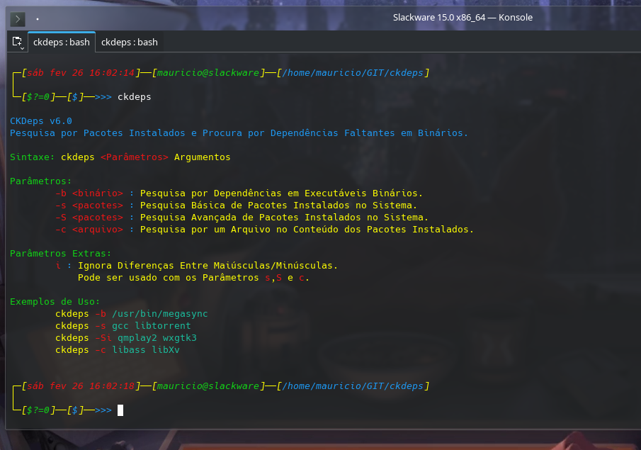
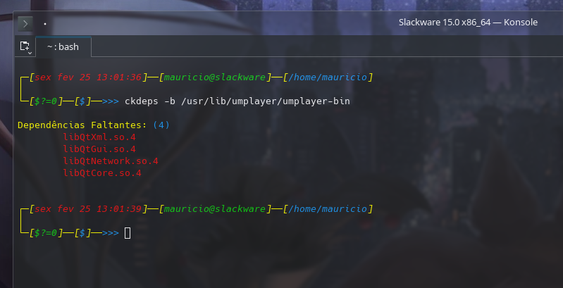
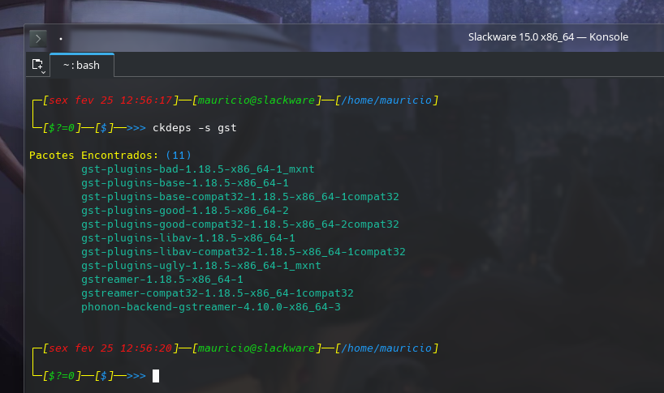
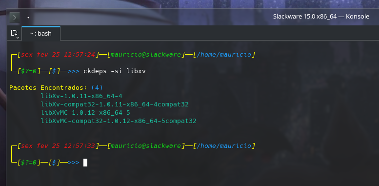
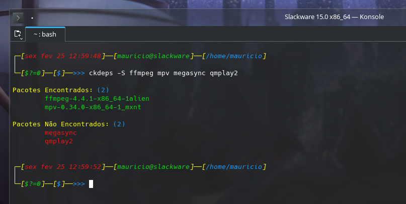
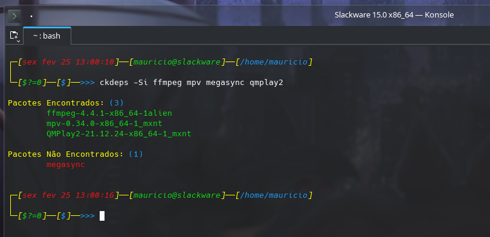
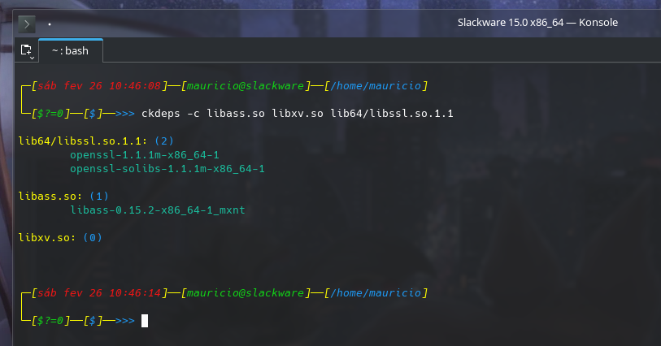
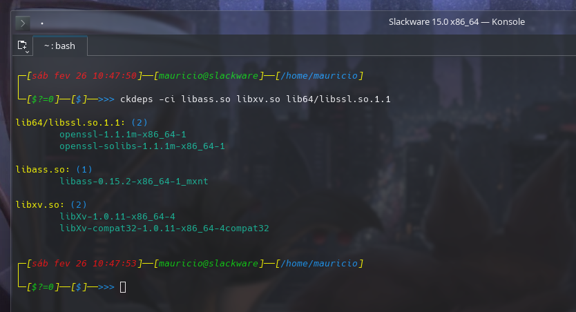

<p align="center">
  
</p>

<h1 align="center"><strong>CkDeps - Check Dependencies for Slackware</strong></h1>
<h3 align="center"> A Slackware utility designed to verify package installation status and locate library ownership.</h3>

<p align="center">
  
  
  
  
  
  
  
  
  
  
</p>

## 🔍 Overview

**CkDeps** is a specialized Slackware utility designed to verify package installation
status and locate library ownership. It efficiently checks if a specific package is
installed and maps shared libraries to their originating packages within the system's
package database.

**CkDeps** is a Slackware utility that allows you to:

- ✅ Check whether a package is installed on the system

- 📚 Identify which package provides a shared library `(.so)`

- ⚡ Perform fast lookups directly in Slackware’s package database

Perfect for system maintenance, package building, and dependency troubleshooting.


 ## 🌌 Previews

<p align="center">
    
    <br/><br/>
    
    <br/><br/>
    
    <br/><br/>
    
    <br/><br/>
    
    <br/><br/>
    
    <br/><br/>
    
    <br/><br/>
    
<p>

## 🚀 Installation

To install **CkDeps**, use the following commands:
```sh
$ git clone https://github.com/LinuxProativo/ckdeps.git
$ cd ckdeps

$ sudo ./install.sh
```

## 🛠️ Support & Contributions

Found a bug, have suggestions, or want to contribute?  
Feel free to open an issue or submit a pull request — all contributions are welcome!

## 📜 GNU General Public License

This repository has scripts that were created to be free software.  
Therefore, they can be distributed and/or modified within the terms of the ***GNU General Public License***.

> ### See the [General Public License](LICENSE) file for details.

## 📬 Contact & Support

* 📧 **Email:** [m10ferrari1200@gmail.com](mailto:m10ferrari1200@gmail.com)
* 📧 **Email:** [contatolinuxdicaspro@gmail.com](mailto:contatolinuxdicaspro@gmail.com)

<p align="center">
  <i>Developed with precision in Shell. 🐚</i>
</p>
